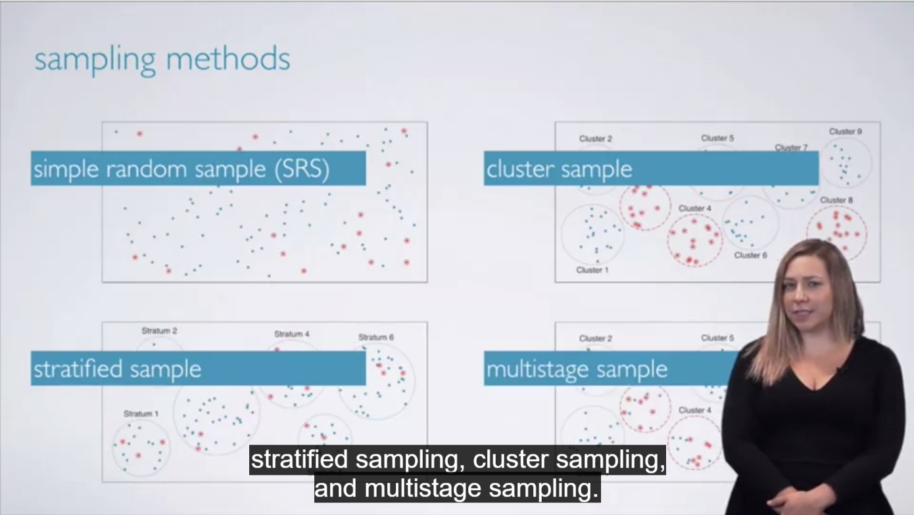

hi this is debrupa nandi
**today is my second day with git**


# studies
**observational - **
1. collect data in a way that does not directly interfere with how the data arise("observe")
2. only establish an association
3. retrospective uses past data
4. prospective - data are collected throughout the study

**experiment**- randomly assign subjects to treatments

Confounding variables - extraneous variables that affect both the explanatory and the response variable and that make it seem like there is a relationship between them

**Correlation does not imply causation**
**Observational staements help make us make correlation statements**
**Experiments help us infer causation**





#### In statistics, a confounder is a variable that influences both the dependent variable and independent variable, causing a spurious association. Confounding is a causal concept, and as such, cannot be described in terms of correlations or associations. ####


```{r}
library(dplyr)
library(ggplot2)
library(statsr)
data(arbuthnot)
View(arbuthnot)
```


```{r}
library(dplyr)
library(ggplot2)
library(statsr)

data(present)
View(present)

present <- present %>%
  mutate(total = boys + girls)
prop_boys <- present$boys/present$total
present <- present %>%
  mutate(prop_boys)
ggplot(data = present, aes(x = year, y = prop_boys)) +
  geom_line() + geom_point() + geom_smooth()
present <- present %>%
  mutate(more_boys = present$boys > present$girls)
View(present)
present <- present %>%
  mutate(prop_boy_girl = boys / girls)
View(present)
ggplot(data = present, aes(x = year, y = prop_boy_girl)) +
  geom_line() + geom_point() + geom_smooth()
present <- present %>%
arrange(desc(total))


```
#### Robust statistics are statistics with good performance for data drawn from a wide range of probability distributions, especially for distributions that are not normal. Robust statistical methods have been developed for many common problems, such as estimating location, scale, and regression parameters. ####

#### The response variable is the focus of a question in a study or experiment. An explanatory variable is one that explains changes in that variable. It can be anything that might affect the response variable. Let’s say you’re trying to figure out if chemo or anti-estrogen treatment is better procedure for breast cancer patients. The question is: which procedure prolongs life more? And so survival time is the response variable. The type of therapy given is the explanatory variable; it may or may not affect the response variable. In this example, we have only one explanatory variable: type of treatment. In real life you would have several more explanatory variables, including: age, health, weight and other lifestyle factors. ####


####  Also known as a parallel boxplot or comparative boxplot, a side-by-side boxplot is a visual display comparing the levels (the possible values) of one categorical variable by means of a quantitative variable. ####


#### In statistical hypothesis testing, the p-value or probability value is, for a given statistical model, the probability that, when the null hypothesis is true, the statistical summary would be equal to, or more extreme than, the actual observed results. ####


```{r}
library(devtools)
library(dplyr)
library(ggplot2)
library(shiny)


```
#### Questions and Solutions of Week 2 ####


```{r}
names(nycflights)
data(nycflights)
View(nycflights)
str(nycflights)
```


#### The dplyr package offers seven verbs (functions) for basic data manipulation:

*filter()*
*arrange()*
*select()*
*distinct()*
*mutate()*
*summarise()*
*sample_n()*
 ####
 
```{r}
ggplot(data = nycflights, aes(x = dep_delay)) +
  geom_histogram()


ggplot(data = nycflights, aes(x = dep_delay)) +
  geom_histogram(binwidth = 25)


ggplot(data = nycflights, aes(x = dep_delay)) +
  geom_histogram(binwidth = 150)
```
 
 
```{r}
 
rdu_flight <- nycflights %>%
filter(dest == "RDU")
ggplot(data = rdu_flight, aes(x = dep_delay)) + geom_histogram()
```


```{r}
rdu_flight %>%
summarise(mean_dd = mean(dep_delay), sd_dd = sd(dep_delay), n = n())
```


#### Summary statistics: Some useful function calls for summary statistics for a single numerical variable are as follows:

mean
median
sd
var
IQR
range
min
max ####


```{r}

sfo_feb_flights <- nycflights %>%
filter(dest == "SFO", month == 2)
View(sfo_feb_flights)
```


```{r}
sfo_feb_flights %>%
summarise(mean_one = mean(arr_delay), median_one = median(arr_delay), sd_one = sd(arr_delay), var_one = var(arr_delay), iqr_one = IQR(arr_delay), min_one = min(arr_delay), max_one = max(arr_delay))
ggplot(data = sfo_feb_flights, aes(x = arr_delay)) + geom_histogram()
```

```{r}
sfo_feb_flights %>%
group_by(carrier) %>%
summarise(iqr_two = IQR(arr_delay)) %>%
arrange(desc(iqr_two))
```

```{r}
nycflights %>%
group_by(month) %>%
summarise(mean_three = mean(dep_delay)) %>%
arrange(desc(mean_three))
```


```{r}
ggplot(data = nycflights, aes(x = factor(month), y = dep_delay)) + geom_boxplot()
```

```{r}
nycflights <- nycflights %>%
mutate(dep_type = ifelse(dep_delay < 5, "on time", "delayed"))
nycflights %>%
group_by(origin) %>%
summarise(ontimerate = sum(dep_type == "on time")/n()) %>%
arrange(desc(ontimerate))
```

```{r}
nycflights %>%
group_by(month) %>%
summarise(medianone = median(dep_delay)) %>%
arrange(desc(medianone))
```

```{r}
nycflights %>%
group_by(month) %>%
summarise(median_three = median(dep_delay)) %>%
arrange(desc(median_three))
```

#### We can also visualize the distribution of on on time departure rate across the three airports using a segmented bar plot. ####

```{r}
ggplot(data = nycflights, aes(x = origin, fill = dep_type)) + geom_bar()
```

```{r}
sfo_feb_flights %>%
group_by(carrier) %>%
summarise(iqr_two = IQR(arr_delay)) %>%
arrange(desc(iqr_two))
```


```{r}
nycflights[,]
```
```{r}
nycflights
```

```{r}
nycflights <- nycflights %>%
  mutate(avg_speed = distance/air_time)
ggplot(data = nycflights, aes(x = distance, y = avg_speed)) + geom_point()

```

```{r}
nycflights <- nycflights %>% 
  mutate(arr_type = ifelse(arr_delay<=0,"on time","delayed")) 

 

nycflights %>% 
  group_by(dep_type)%>%
  summarise(ot_arr_rate=sum(arr_type=="on time")/n())
```


