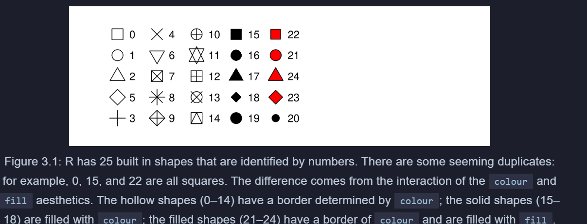

```{r}
library(tidyverse)
#install.packages(c("nycflights13", "gapminder", "Lahman"))
#library(nycflights13)
#library(gapminder)
#library(Lahman)

```


#### Hypothesis confirmation
It’s possible to divide data analysis into two camps: hypothesis generation and hypothesis confirmation (sometimes called confirmatory analysis). The focus of this book is unabashedly on hypothesis generation, or data exploration. Here you’ll look deeply at the data and, in combination with your subject knowledge, generate many interesting hypotheses to help explain why the data behaves the way it does. You evaluate the hypotheses informally, using your scepticism to challenge the data in multiple ways.

The complement of hypothesis generation is hypothesis confirmation. Hypothesis confirmation is hard for two reasons:

You need a precise mathematical model in order to generate falsifiable predictions. This often requires considerable statistical sophistication.

You can only use an observation once to confirm a hypothesis. As soon as you use it more than once you’re back to doing exploratory analysis. This means to do hypothesis confirmation you need to “preregister” (write out in advance) your analysis plan, and not deviate from it even when you have seen the data. We’ll talk a little about some strategies you can use to make this easier in modelling.

It’s common to think about modelling as a tool for hypothesis confirmation, and visualisation as a tool for hypothesis generation. But that’s a false dichotomy: models are often used for exploration, and with a little care you can use visualisation for confirmation. The key difference is how often do you look at each observation: if you look only once, it’s confirmation; if you look more than once, it’s exploration. ####


```{r}
library(ggplot2)
ggplot(mpg, aes(x = displ, y = hwy)) + geom_point(aes(colour = class))
```

```{r}
dput(mtcars)
```


```{r}
ggplot(data = mpg, aes(x = displ, y = hwy)) + geom_point()
```

```{r}
ggplot(data = mpg) + geom_point(mapping = aes(x = displ, y = hwy))
```

```{r}
ggplot(data = mpg)
```


3.2.4 Exercises
Run ggplot(data = mpg). What do you see?


```{r}
ggplot(data = mpg)
```


2.How many rows are in mpg? How many columns?


```{r}
dim(mpg)
```


3.What does the drv variable describe? Read the help for ?mpg to find out.


```{r}
?mpg
```
f = front-wheel drive, r = rear wheel drive, 4 = 4wd

4.Make a scatterplot of hwy vs cyl.


```{r}
ggplot(data = mpg, aes(x = hwy, y = cyl)) + geom_point()
```


4 . What happens if you make a scatterplot of class vs drv? Why is the plot not useful?

```{r}
ggplot(data = mpg, aes(x = class, y = drv)) + geom_point()
```


```{r}
ggplot(data = mpg, aes(x = displ, y = hwy, colour = class)) + geom_point()
```
To map an aesthetic to a variable, associate the name of the aesthetic to the name of the variable inside aes(). ggplot2 will automatically assign a unique level of the aesthetic (here a unique color) to each unique value of the variable, a process known as scaling. ggplot2 will also add a legend that explains which levels correspond to which values.


```{r}
ggplot(data = mpg, aes(x = displ, y = hwy, size = class)) + geom_point()
```


```{r}
ggplot(data = mpg, aes(x = displ, y = hwy, alpha = class)) + geom_point()
```


```{r}
ggplot(data = mpg, aes(x = displ, y = hwy, shape = class)) + geom_point()
```


```{r}
ggplot(data = mpg, aes(x = displ, y = hwy, color = "blue")) + geom_point()
```


```{r}
ggplot(data = mpg) + geom_point(mapping = aes(x = displ, y = hwy), color = "blue")
```


```{r}
ggplot(data = mpg, aes(x = displ, y = hwy, color = "blue")) + geom_point()
```


```{r}
ggplot(data = mpg, aes(x = displ, y = hwy), color = "blue") + geom_point()
```

1. What’s gone wrong with this code? Why are the points not blue?


```{r}
ggplot(data = mpg, aes(x = displ, y = hwy, color = "blue")) + geom_point()
```
2. Which variables in mpg are categorical? Which variables are continuous? (Hint: type ?mpg to read the documentation for the dataset). How can you see this information when you run mpg?


```{r}
View(mpg)
```
categorical: manufacturer ,model, year, trans, drv, fl, class
continuous: displ, fl


3. Map a continuous variable to color, size, and shape. How do these aesthetics behave differently for categorical vs. continuous variables?
```{r}
ggplot(data = mpg) + geom_point(mapping = aes(x = displ, y = hwy, color = cyl, size = hwy, shape = drv))
```


4.What happens if you map the same variable to multiple aesthetics?

```{r}
ggplot(data = mpg) + geom_point(mapping = aes(x = displ, y = hwy, color = displ, size = displ, shape = model))
```


5. What does the stroke aesthetic do? What shapes does it work with?

Stroke controls the width of the border, for shapes that have one.
```{r}
ggplot(data = mpg, aes(x = displ, y = hwy, stroke = displ), shape = 21) + geom_point()
```
 
 6. What happens if you map an aesthetic to something other than a variable name, like aes(colour = displ < 5)? Note, you’ll also need to specify x and y.
 
```{r}
ggplot(data = mpg, aes(x = displ, y = hwy, stroke = displ), color = displ < 5, shape = 21) + geom_point()
```

```{r}
str(mpg)
```
```{r}
ggplot(data = mpg) + geom_point(mapping = aes(x = displ, y = hwy))
```





** FACETS  - takes discrete and categorical variable**


```{r}
ggplot(data = mpg) + 
  geom_point(mapping = aes(x = displ, y = hwy)) + 
  facet_wrap(~ class, nrow = 2)
```
```{r}
?mpg
```
```{r}
ggplot(data = mpg) + 
  geom_point(mapping = aes(x = displ, y = hwy)) + 
  facet_grid(fl~ displ)
```
To facet your plot on the combination of two variables, add facet_grid() to your plot call. The first argument of facet_grid() is also a formula. This time the formula should contain two variable names separated by a ~.   


#### If you prefer to not facet in the rows or columns dimension, use a . instead of a variable name, e.g. + facet_grid(. ~ cyl).

1. What happens if you facet on a continuous variable?
There is one facet for each value e.g. a facet on displ.


```{r}

ggplot(data = mpg) + 
  geom_point(mapping = aes(x = cyl, y = hwy)) +
  facet_wrap(~ displ)
```


2. What do the empty cells in plot with facet_grid(drv ~ cyl) mean? How do they relate to this plot?

```{r}
ggplot(data = mpg) + 
  geom_point(mapping = aes(x = drv, y = cyl))
```


```{r}
ggplot(data = mpg) + 
  geom_point(mapping = aes(x = displ, y = hwy)) + 
  facet_grid(drv ~ cyl)
```


the blank boxes tell us that there is no data, satisfying the conditions on the right and top bars.

3. What plots does the following code make? What does . do?


```{r}
ggplot(data = mpg) + geom_point(mapping = aes(x = displ, y = hwy)) + facet_grid(drv ~ .)
```

```{r}
ggplot(data = mpg) + geom_point(mapping = aes(x = displ, y = hwy)) + facet_grid(. ~cyl)
```

the placement of "." differs the presentation of data, either row wise or coloumn wise. "." on the right side plots the data row wise with the parameter marked on the left side

the placement of "." differs the presentation of data, either row wise or coloumn wise. "." on the left side plots the data coloumn wise with the parameter marked on the top


4. Take the first faceted plot in this section:

```{r}
ggplot(data = mpg) + geom_point(mapping = aes(x = displ, y = hwy)) + facet_wrap(~class, nrow = 2)
```
 4 . What are the advantages to using faceting instead of the colour aesthetic? What are the disadvantages? How might the balance change if you had a larger dataset?
 
With faceting it is easier to examine the indivual classes. With coloring it is easier to see how the classes are clustered overall. With larger datasets it’s more likely that you want to see the overall clustering instead of the individual point clouds.

5. Read ?facet_wrap. What does nrow do? What does ncol do? What other options control the layout of the individual panels? Why doesn’t facet_grid() have nrow and ncol arguments?


Facet grids do not have these configuration because the rows and cols are determined by the specified attributes.


6.When using facet_grid() you should usually put the variable with more unique levels in the columns. Why?


When putting the more levels on the row axis, then the y-axis would shrink so that it is harder to see which actual values are at the points as shown in the plot.

```{r}
ggplot(data = mpg) + geom_point(mapping = aes(x = displ, y = hwy))
```


```{r}
ggplot(data = mpg) + geom_smooth(mapping = aes(x = displ, y = hwy))
```


```{r}
ggplot(data = mpg) + geom_smooth(mapping = aes(x = displ, y = hwy, linetype = drv))
```


Here geom_smooth() separates the cars into three lines based on their drv value, which describes a car’s drivetrain. One line describes all of the points with a 4 value, one line describes all of the points with an f value, and one line describes all of the points with an r value. Here, 4 stands for four-wheel drive, f for front-wheel drive, and r for rear-wheel drive.


```{r}
ggplot(data = mpg) + geom_smooth(mapping = aes(x = displ, y = hwy))
```


```{r}
ggplot(data = mpg) + geom_smooth(mapping = aes(x = displ, y = hwy, group = drv))
```


```{r}
ggplot(data = mpg) + geom_smooth(mapping = aes(x = displ, y = hwy, colour = drv))
```


```{r}
ggplot(data = mpg) + geom_smooth(mapping = aes(x = displ, y = hwy, colour = drv), show.legend = FALSE)
```


```{r}
ggplot(data = mpg) + geom_point(mapping = aes(x = displ, y = hwy)) + geom_smooth(mapping = aes(x = displ, y = hwy))
```


```{r}
ggplot(data = mpg, aes(x = displ, y = hwy)) + geom_point() + geom_smooth()
```


```{r}
ggplot(data = mpg, aes(x = displ, y = cty)) + geom_point() + geom_smooth()
```

```{r}
?mpg
```


If you place mappings in a geom function, ggplot2 will treat them as local mappings for the layer. It will use these mappings to extend or overwrite the global mappings for that layer only. This makes it possible to display different aesthetics in different layers.

```{r}
ggplot(data = mpg, aes(x = displ, y = hwy)) + geom_point(aes(colour = class)) + geom_smooth()
```


You can use the same idea to specify different data for each layer. Here, our smooth line displays just a subset of the mpg dataset, the subcompact cars. The local data argument in geom_smooth() overrides the global data argument in ggplot() for that layer only.


```{r}
ggplot(data = mpg, aes(x = displ, y = hwy))  + geom_point(aes(colour = class))  + geom_smooth(data = filter(mpg, class == "subcompact"), se = FALSE)
```


```{r}
ggplot(data= diamonds)  + geom_bar(mapping = aes(x  = cut))
```
On the x-axis, the chart displays cut, a variable from diamonds. On the y-axis, it displays count, but count is not a variable in diamonds! Where does count come from? Many graphs, like scatterplots, plot the raw values of your dataset. Other graphs, like bar charts, calculate new values to plot:

bar charts, histograms, and frequency polygons bin your data and then plot bin counts, the number of points that fall in each bin.

smoothers fit a model to your data and then plot predictions from the model.

boxplots compute a robust summary of the distribution and then display a specially formatted box.


```{r}
ggplot(data = diamonds) + stat_count(mapping = aes(x = cut))
```

```{r}
?diamonds
```

```{r}
demo <- tribble(
  ~cut,         ~freq,
  "Fair",       1610,
  "Good",       4906,
  "Very Good",  12082,
  "Premium",    13791,
  "Ideal",      21551
)

ggplot(data = demo) +
  geom_bar(mapping = aes(x = cut, y = freq), stat = "identity")
```
```{r}
?diamonds
```

```{r}
ggplot(data = diamonds) + geom_bar(mapping = aes(x = cut, y = ..prop..,group = 1))
```


```{r}
ggplot(data = diamonds) + stat_summary(mapping = aes(x = cut, y = depth), fun.ymin = min, fun.ymax = max, fun.y = median)
```

```{r}
?stat_bin
```


1. What is the default geom associated with stat_summary()? How could you rewrite the previous plot to use that geom function instead of the stat function?


stat_summary` is associated with `geom_pointrange`.

```{r}
ggplot(diamonds) + geom_pointrange(aes(cut, depth, ymin = depth, ymax = depth, fatten = 1))
```


```{r}
?geom_pointrange()
```


```{r}
ggplot(diamonds) + geom_pointrange(aes(cut, depth, ymin = depth, ymax = depth, fatten = 1))
```


```{r}
ggplot(diamonds) + geom_pointrange(mapping = aes(x = cut, y = depth), 
            stat = "summary", 
            fun.ymin = min, 
            fun.ymax = max, 
            fun.y = median)

```

2. What does geom_col() do? How is it different to geom_bar()?

```{r}
ggplot(data = diamonds) + geom_col()


```


```{r}
df <- data.frame(trt = c("a", "b", "c"), outcome = c(2.3, 1.9, 3.2))
ggplot(df, aes(trt, outcome)) +
  geom_col()
```


geom_bar can work with one arguement and geom_col cannot work with one 1 arguement. If you want the heights of the bars to represent values in the data, use geom_col() instead. geom_bar() uses stat_count() by default: it counts the number of cases at each x position. geom_col() uses stat_identity(): it leaves the data as is.


3. Most geoms and stats come in pairs that are almost always used in concert. Read through the documentation and make a list of all the pairs. What do they have in common?

4. What variables does stat_smooth() compute? What parameters control its behaviour?

stat_smooth()` computes the y, the predicted value of y for each x value. Also, it computes
the se of that value predicted, together with the upper and lower bound of that point prediction.

```{r}
ggplot(data = diamonds, aes(x = price, y = carat)) + stat_smooth()
```


5. In our proportion bar chart, we need to set group = 1. Why? In other words what is the problem with these two graphs?

```{r}
ggplot(data = diamonds) + 
  geom_bar(mapping = aes(x = cut, y = ..prop..,group = 1))
```

```{r}
ggplot(data = diamonds) + 
  geom_bar(mapping = aes(x = cut, fill = color, y = ..prop..,group = 1))
```
```{r}
ggplot(data = diamonds) + 
  geom_bar(mapping = aes(x = cut, y = ..prop.., group = 1))
```

```{r}
ggplot(data = diamonds) + 
  geom_bar(mapping = aes(x = cut, y = ..count../sum(..count..), fill = color))
```

```{r}
ggplot(data = diamonds) + geom_bar(mapping = aes(x = cut, fill = cut))
```
```{r}
ggplot(data = diamonds) + geom_bar(mapping = aes(x = cut, color = cut))
```


```{r}
ggplot(data = diamonds) + geom_bar(mapping = aes(x = cut, fill = cut))
```


```{r}
ggplot(data = diamonds) + geom_bar(mapping = aes(x = cut, fill = clarity))
```
The stacking is performed automatically by the position adjustment specified by the position argument. If you don’t want a stacked bar chart, you can use one of three other options: "identity", "dodge" or "fill".


```{r}
ggplot(data = diamonds, mapping = aes(x = cut, fill = clarity)) + geom_bar(alpha = 1/10, position = "identity")
```

```{r}
ggplot(data = diamonds, mapping = aes(x = cut, color = clarity)) + geom_bar(fill = NA, position = "identity")
```


position = "fill" works like stacking, but makes each set of stacked bars the same height. This makes it easier to compare proportions across groups.


```{r}
ggplot(data = diamonds) + geom_bar(mapping = aes(x = cut, fill = clarity), position = "fill")
```

position = "dodge" places overlapping objects directly beside one another. This makes it easier to compare individual values

```{r}
ggplot(data = diamonds) + geom_bar(mapping = aes(x = cut, fill = clarity), position = "dodge")
```


The values of hwy and displ are rounded so the points appear on a grid and many points overlap each other. This problem is known as overplotting. This arrangement makes it hard to see where the mass of the data is. Are the data points spread equally throughout the graph, or is there one special combination of hwy and displ that contains 109 values?

You can avoid this gridding by setting the position adjustment to “jitter”. position = "jitter" adds a small amount of random noise to each point. This spreads the points out because no two points are likely to receive the same amount of random noise.


```{r}
ggplot(data = mpg) + geom_point(mapping = aes(x = displ, y = hwy), position = "jitter", size = 3, color = "red", alpha = 1/2)
```


